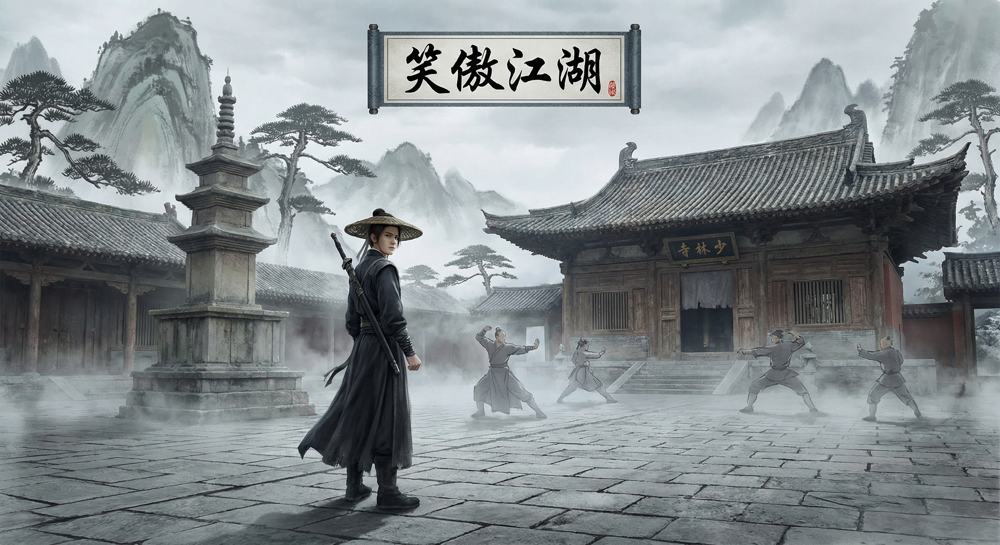

# YumFu - Multi-World MUD 🌍⚔️🪄

**Choose Your Adventure** - Text-based RPG with AI-generated art across multiple fantasy universes

[](https://www.gnu.org/licenses/gpl-3.0)
[](SECURITY.md)
[](SECURITY.md)
[](PRIVACY.md)
[](https://clawhub.ai/skills/yumfu)

---

## 🔒 Privacy & Data

YumFu is **local-first** and respects your privacy:

- ✅ **All game data stored locally** on your machine
- ✅ **No telemetry or tracking**
- ✅ **Session logging is optional** (`YUMFU_NO_LOGGING=1` to disable)
- ✅ **AI images are optional** (`YUMFU_NO_IMAGES=1` for text-only)
- ✅ **Only external API**: Google Gemini (optional, for images only)
- ✅ **Open source**: Fully auditable (GPLv3)

**See [PRIVACY.md](PRIVACY.md) for full privacy policy**

---

## 🎨 **World Showcase**

<table>
<tr>
<td width="33%">

### ⚔️ Chinese Wuxia

*Ancient martial arts world - Traditional temples, misty mountains, heroic swordsmen*

</td>
<td width="33%">

### ⚡ Wizard School

*Magical academy - Underground chambers, enchanted lakes, spell practice*

</td>
<td width="33%">

### 🐉 Medieval Fantasy

*Political intrigue - Desert palaces, noble houses, strategic conflicts*

</td>
</tr>
</table>

*All images generated in real-time during gameplay with world-specific art styles*

---

## 🌎 Available Worlds

YumFu offers multiple fantasy universes to explore. Each world has unique gameplay mechanics, art styles, and storylines.

### 🇨🇳 Chinese Wuxia (中文武侠)
- ⚔️ **Swordsman Tales** - Martial arts sects, honor duels, legendary techniques
- 🗡️ **Dragon & Sword Epic** - Ancient artifacts, mystical powers *(coming soon)*
- 📖 **Hero Legends** - Classic wuxia adventures *(coming soon)*

### 🇬🇧 Western Fantasy
- ⚡ **Wizard School** - Magic academy, four houses, spell duels
- 🐱 **Warrior Clans** - Feline tribes, forest territories, clan politics
- 🗡️ **Middle-earth Quest** - Epic journey, fellowship, ancient evil ✅
- 🐉 **Medieval Kingdoms** - Political intrigue, noble houses, throne wars ✅
- 🐺 **Monster Hunter** - Witcher-inspired adventures *(coming soon)*

---

## 🚀 Quick Start

### 🎮 Two Ways to Play

**Option 1: Commands** (Classic MUD style)
```bash
/yumfu start
/yumfu look
/yumfu fight wild boar
```

**Option 2: Natural Language** (Just talk!)
```
"I want to explore the forest"
"Attack the goblin with my sword"
"Talk to Dumbledore about the Elder Wand"
"我想去华山派学剑法"
```

**💡 Pro Tip**: You don't need to use `/yumfu` commands! Your AI agent understands natural language. Just describe what you want to do in the game, and the agent will handle it.

---

### 📖 Setup Steps

**Step 1: Choose Language** | **选择语言**
```
🌍 Welcome to YumFu! | 欢迎来到YumFu！

1. 中文 (Chinese)
2. English

Reply: /yumfu lang 1  (or just say "Chinese please")
```

**Step 2: Choose Your World** | **选择世界**
```
Choose your realm:

1. ⚔️ 笑傲江湖 (Xiaoao Jianghu)
2. ⚡ Harry Potter Universe
3. 🐱 Warrior Cats

Reply: /yumfu world 3  (or just say "I want to play Warrior Cats")
```

**Step 3: Start Your Adventure!**

---

## ✨ Features

- 🗣️ **Natural Language** - Just talk! No need for commands (e.g., "I want to explore the castle")
- 🌍 **Multi-language** - Chinese & English
- 🎭 **Multiple universes** - Wuxia, Harry Potter, LOTR, GoT...
- 🎨 **AI-generated art** - Each scene gets a styled illustration
- 🤝 **Multiplayer** - PvP duels, teams (OpenClaw only)
- 📖 **Rich storytelling** - Authentic genre writing
- 💾 **Save system** - Multiple save slots per world

---

## 🎮 Core Systems

- **Character progression** - Level 1-100, skill trees
- **Combat system** - Turn-based with strategy
- **Faction reputation** - Join houses/sects, earn respect
- **Legendary artifacts** - Elder Wand, One Ring, Nine Yin Manual...
- **NPC interactions** - Dumbledore, Gandalf, Dongfang Bubai...

---

## 平台兼容性 | Platform Compatibility

**✅ Full support: OpenClaw**
- Multiplayer (PvP, teams)
- Auto-send images
- Telegram groups

**⚠️ Partial support: Claude Code / Native Claude**
- Single-player only
- Manual image viewing
- See `COMPATIBILITY.md`

---

## 配置 | Configuration

**Required:**
- `GEMINI_API_KEY` (for AI art generation, optional)
- Python 3.x + `uv` (to run image scripts)

**Optional:**
- `YUMFU_NO_IMAGES=1` - Text-only mode (no API key needed)

---

## 📂 Project Structure

```
yumfu/
├── worlds/              # World configurations
│   ├── xiaoao.json      # 笑傲江湖
│   └── harry-potter.json # Harry Potter
├── i18n/                # Localization
│   ├── zh.json          # Chinese UI
│   └── en.json          # English UI
├── scripts/
│   ├── generate_image.py  # AI art generation
│   └── backup.sh          # Local save backup
├── SKILL.md             # Full documentation
├── MULTI-WORLD-DESIGN.md # Design philosophy
└── COMPATIBILITY.md     # Platform guide
```

---

## 🗺️ Roadmap

### Phase 1 ✅ (Complete)
- [x] Chinese (笑傲江湖)
- [x] English (Harry Potter)
- [x] Bilingual UI
- [x] World config system

### Phase 2 (Next)
- [ ] Add LOTR, GoT, The Witcher
- [ ] More Chinese worlds (倚天, 射雕, 天龙)
- [ ] Cross-world easter eggs

### Phase 3 (Future)
- [ ] Community-contributed worlds
- [ ] Custom world editor
- [ ] Character import across worlds

---

## 🎯 Example Gameplay

### 笑傲江湖 (Xiaoao Jianghu)

**Using Commands:**
```
你来到华山派，宁中则看着你说："孩子，江湖险恶，好好修炼。"
[获得] 华山剑谱（初级）
[体力] 100/100  [内力] 50/50

> /yumfu train 华山剑法
你在思过崖苦练剑法，突然领悟了「有凤来仪」...
[华山剑法] Lv1 → Lv2
```

**Using Natural Language:**
```
> "我想去找风清扬学独孤九剑"
你登上思过崖，一位白发老者正在对弈...

> "向风清扬行礼，请求传授剑法"
风清扬看了你一眼："有点根骨，先破解这三招。"
[开始] 剑法测试
```

---

### Harry Potter

**Using Commands:**
```
You arrive at Diagon Alley. Ollivander peers at you curiously.
"Ah, a new wand-bearer. Let me see..."
[Obtained] Phoenix Feather Wand
[HP] 100/100  [MP] 50/50

> /yumfu train Expelliarmus
You practice the Disarming Charm in the Room of Requirement...
[Expelliarmus] Lv1 → Lv2
```

**Using Natural Language:**
```
> "I want to explore the Forbidden Forest"
You step past Hagrid's hut into the shadowy woods...

> "Cast Lumos to light the way"
Your wand-tip ignites! Spiders scatter in the silver glow.
[Learned] Lumos (Basic Light Charm)
```

---

### Warrior Cats

**Using Commands:**
```
You pad into ThunderClan camp. Firestar looks at you with warm eyes.
"Welcome, young kit. You will train hard to become a warrior."
[Obtained] Apprentice Name: Rushpaw
[HP] 100/100  [Stamina] 50/50

> /yumfu hunt mouse
You crouch low in the undergrowth, tail still. A mouse scurries by...
[Success!] You caught a plump mouse for the fresh-kill pile!
[Forest Stalking] Lv1 → Lv2
```

**Using Natural Language:**
```
> "I want to go on a border patrol with my mentor"
Willowpelt nods. "Follow me to the ShadowClan border, Rushpaw."

> "Sniff the air for enemy scent"
You taste the wind... RiverClan! Fresh markers, less than a sunrise old.
[Learned] Scent Tracking
```

---

**💡 Remember**: Commands like `/yumfu fight` are optional shortcuts. You can always just talk to your agent naturally!

---

## 🤝 Contributing

Want to add a new world? See `MULTI-WORLD-DESIGN.md` for the template!

Ideas for new worlds:
- Naruto (ninja villages)
- Star Wars (Jedi/Sith)
- Greek Mythology (gods & heroes)
- Cyberpunk 2077 (netrunners & corpo)

---

## 📜 License

**YumFu** is licensed under the [GNU General Public License v3.0 (GPLv3)](LICENSE).

This means:
- ✅ You can **use, modify, and distribute** this software freely
- ✅ You can use it for **commercial purposes**
- ⚠️ If you distribute modified versions, you **must**:
  - Release the source code under GPLv3
  - Include the original copyright notice
  - State what changes you made

**TL;DR**: Open source forever, derivative works must also be open source.

See the [full license text](LICENSE) for details.

---

**江湖路远，侠之大者！** | **The adventure awaits, brave wizard!** ⚔️🪄
