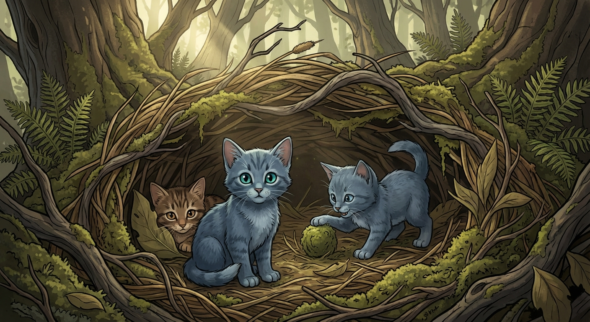

# YumFu - Multi-World MUD 🌍⚔️🪄

**Choose Your Adventure** - Text-based RPG with AI-generated art across multiple fantasy universes

---

## 🎨 **Game Screenshots**

### Warrior Cats - Nursery Scene

*Three RiverClan kits (Tumkit, Splashkit, Reedkit) playing moss-ball in their cozy reed den - Generated with Warrior Cats art style (semi-realistic feral cats, forest setting, Wayne McLoughlin aesthetic)*

---

## 🌐 Supported Worlds

### 🇨🇳 中文世界 (Chinese Wuxia)
- ⚔️ **笑傲江湖** (Xiaoao Jianghu) - Swordsman era, Mt. Hua Sect conflicts
- 🗡️ **倚天屠龙记** (Yitian Tulongji) - Heaven Sword - 🗡️ **倚天屠龙记** (Yitian Tulongji) - Heaven Sword & Dragon Saber *(coming soon)* Dragon Saber, Zhang Wuji, Ming Cult ✅
- 📖 **射雕英雄传** (Shediao Yingxiongzhuan) - Legend of the Condor Heroes *(coming soon)*

### 🇬🇧 English Worlds (Fantasy)
- ⚡ **Harry Potter** - Hogwarts, four houses, wizarding duels
- 🐱 **Warrior Cats** - ThunderClan, RiverClan, WindClan, ShadowClan
- 🗡️ **Lord of the Rings** - Middle-earth, Fellowship of the Ring, destroy One Ring ✅
- 🐉 **Game of Thrones** - Westeros, Iron Throne, War of Five Kings ✅
- 🐺 **The Witcher** - Monster hunting, Signs *(coming soon)*

---

## 🚀 Quick Start

```bash
/yumfu start
```

**Step 1: Choose Language** | **选择语言**
```
🌍 Welcome to YumFu! | 欢迎来到YumFu！

1. 中文 (Chinese)
2. English

Reply: /yumfu lang 1
```

**Step 2: Choose Your World** | **选择世界**
```
Choose your realm:

1. ⚔️ 笑傲江湖 (Xiaoao Jianghu)
2. ⚡ Harry Potter Universe
3. 🐱 Warrior Cats

Reply: /yumfu world 3
```

**Step 3: Start Your Adventure!**

---

## ✨ Features

- 🌍 **Multi-language** - Chinese & English
- 🎭 **Multiple universes** - Wuxia, Harry Potter, LOTR, GoT...
- 🎨 **AI-generated art** - Each scene gets a styled illustration
- 🤝 **Multiplayer** - PvP duels, teams (OpenClaw only)
- 📖 **Rich storytelling** - Authentic genre writing
- 💾 **Save system** - Multiple save slots per world

---

## 🎮 Core Systems

- **Character progression** - Level 1-100, skill trees
- **Combat system** - Turn-based with strategy
- **Faction reputation** - Join houses/sects, earn respect
- **Legendary artifacts** - Elder Wand, One Ring, Nine Yin Manual...
- **NPC interactions** - Dumbledore, Gandalf, Dongfang Bubai...

---

## 平台兼容性 | Platform Compatibility

**✅ Full support: OpenClaw**
- Multiplayer (PvP, teams)
- Auto-send images
- Telegram groups

**⚠️ Partial support: Claude Code / Native Claude**
- Single-player only
- Manual image viewing
- See `COMPATIBILITY.md`

---

## 配置 | Configuration

**Required:**
- `GEMINI_API_KEY` (for AI art generation, optional)
- Python 3.x + `uv` (to run image scripts)

**Optional:**
- `YUMFU_NO_IMAGES=1` - Text-only mode (no API key needed)

---

## 📂 Project Structure

```
yumfu/
├── worlds/              # World configurations
│   ├── xiaoao.json      # 笑傲江湖
│   └── harry-potter.json # Harry Potter
├── i18n/                # Localization
│   ├── zh.json          # Chinese UI
│   └── en.json          # English UI
├── scripts/
│   ├── generate_image.py  # AI art generation
│   └── backup.sh          # Local save backup
├── SKILL.md             # Full documentation
├── MULTI-WORLD-DESIGN.md # Design philosophy
└── COMPATIBILITY.md     # Platform guide
```

---

## 🗺️ Roadmap

### Phase 1 ✅ (Complete)
- [x] Chinese (笑傲江湖)
- [x] English (Harry Potter)
- [x] Bilingual UI
- [x] World config system

### Phase 2 (Next)
- [ ] Add LOTR, GoT, The Witcher
- [ ] More Chinese worlds (倚天, 射雕, 天龙)
- [ ] Cross-world easter eggs

### Phase 3 (Future)
- [ ] Community-contributed worlds
- [ ] Custom world editor
- [ ] Character import across worlds

---

## 🎯 Example Gameplay

### 笑傲江湖 (Xiaoao Jianghu)
```
你来到华山派，宁中则看着你说："孩子，江湖险恶，好好修炼。"
[获得] 华山剑谱（初级）
[体力] 100/100  [内力] 50/50

> /yumfu train 华山剑法
你在思过崖苦练剑法，突然领悟了「有凤来仪」...
[华山剑法] Lv1 → Lv2
```

### Harry Potter
```
You arrive at Diagon Alley. Ollivander peers at you curiously.
"Ah, a new wand-bearer. Let me see..."
[Obtained] Phoenix Feather Wand
[HP] 100/100  [MP] 50/50

> /yumfu train Expelliarmus
You practice the Disarming Charm in the Room of Requirement...
[Expelliarmus] Lv1 → Lv2
```

### Warrior Cats
```
You pad into ThunderClan camp. Firestar looks at you with warm eyes.
"Welcome, young kit. You will train hard to become a warrior."
[Obtained] Apprentice Name: Rushpaw
[HP] 100/100  [Stamina] 50/50

> /yumfu hunt mouse
You crouch low in the undergrowth, tail still. A mouse scurries by...
[Success!] You caught a plump mouse for the fresh-kill pile!
[Forest Stalking] Lv1 → Lv2
```

---

## 🤝 Contributing

Want to add a new world? See `MULTI-WORLD-DESIGN.md` for the template!

Ideas for new worlds:
- Naruto (ninja villages)
- Star Wars (Jedi/Sith)
- Greek Mythology (gods & heroes)
- Cyberpunk 2077 (netrunners & corpo)

---

## 📜 License

Open source - feel free to fork and add your own worlds!

---

**江湖路远，侠之大者！** | **The adventure awaits, brave wizard!** ⚔️🪄
