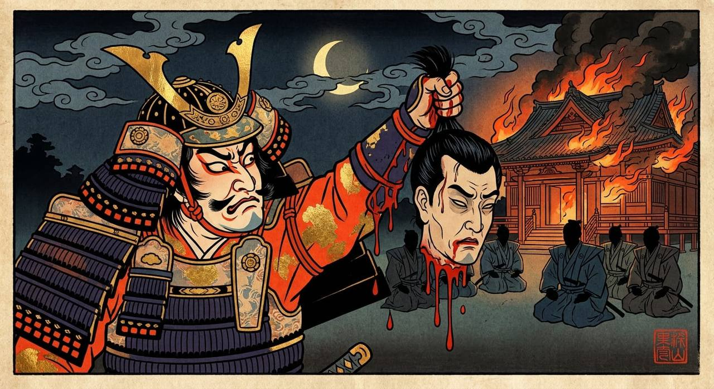

# ⚔️ Decapitation at Honnō-ji

*A brutal YumFu Sengoku-style scene: a victorious warrior lifts Akechi Mitsuhide's severed head as Honnō-ji burns in the background.*

---

## English scene translation

### ⚔️🩸 Severance

You did not hesitate.

Mitsuhide tried to say something — his lips moved. Maybe it was a last word, maybe only a name. But you had already drawn your blade.

**[Beheading check]** d20+5 = 22 vs Mitsuhide’s struggle d20+1 = 21  
⚡ Narrow win! In the very last instant he desperately twisted his head aside — but the wound in his shoulder slowed him.

One stroke.

Clean.

---

Mitsuhide’s head rolled across the wooden floor of Honnō-ji, the eyes still half open, that eerie smile frozen in place.

Your rōnin fell to their knees. In the firelight, you raised the head in one hand, blood dripping onto the tatami.

No one struck the bell of Honnō-ji, yet the flames licking across the beams made it hum all the same.

---

## 📦 Items obtained

- 🔴 **Akechi Mitsuhide’s head** — trophy item (can be presented for reward)
- 📜 **Secret letter from Mitsuhide’s robe ×1** — bloodstained, contents not yet deciphered
- 🗡️ **Mitsuhide’s sword, _Ōmi no Kami Kanesada_** — a famous blade, never even drawn before he was killed

**[Condition of the head]** d6 = 1 → Face intact, one perfect stroke, top-grade military proof

---

## 🏯 Choice of whom to present it to

Word will spread quickly — Akechi Mitsuhide has died at Honnō-ji. But the head is in your hands. Whom you carry it to will decide your next fate.

**[Projected reaction of the recipient]** d100 = 80  
No matter whom you present it to, they will take it seriously.

Whom do you offer it to?

1. **Oda Nobunaga** — Mitsuhide was once his retainer; present the rebel’s head and seek direct reward
2. **Toyotomi Hideyoshi** — now the strongest rising power; offer the head and gamble on a better station
3. **Tokugawa Ieyasu** — the old fox building power in the shadows; perhaps the longest-lasting reward lies there
4. **No one.** Keep it for yourself and proclaim to the realm: *“I killed Mitsuhide.”* Carve out your own power

---

## 📊 Status update

- **Infamy +20** — beheading inside a temple, ruthless and decisive
- **Martial fame +25** — slew a famous great general
- **❓ Secret letter unread** — whatever Mitsuhide wanted to say before dying… will never be known

💀 You chose the blade, not the ear. Some answers left with the blood.

---

## Why this scene is a good YumFu showcase

This is the kind of turn YumFu is good at:

- dramatic world-specific scene art
- explicit loot and state updates
- branching political follow-up choices
- a strong “one screenshot tells a story” moment

It works well as a GitHub showcase image because it immediately communicates that YumFu is not just plain text — it can feel like a playable illustrated historical drama.
